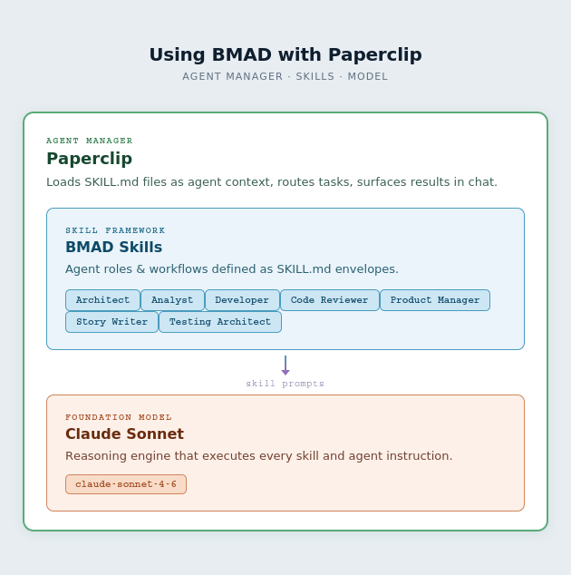
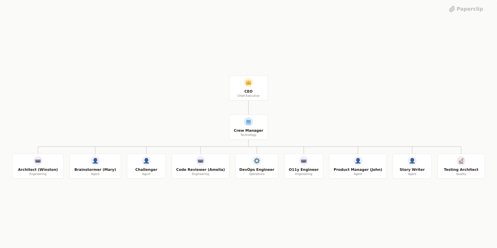
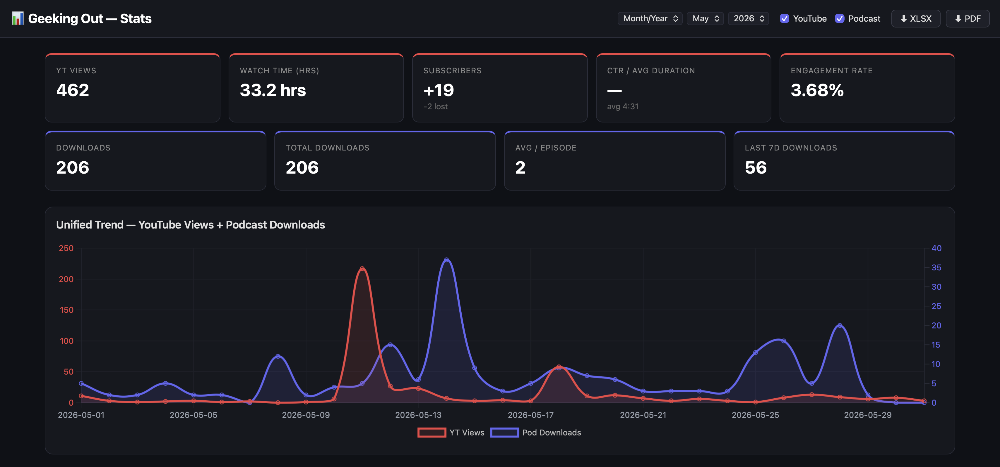
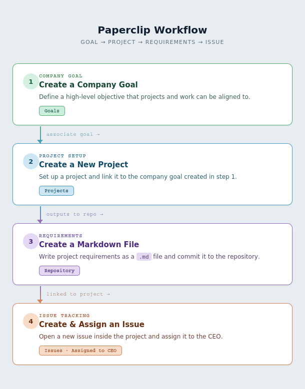
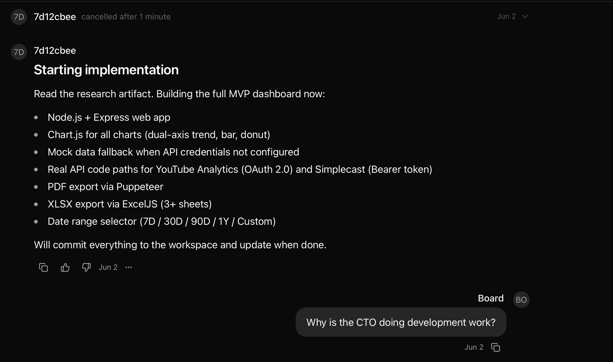
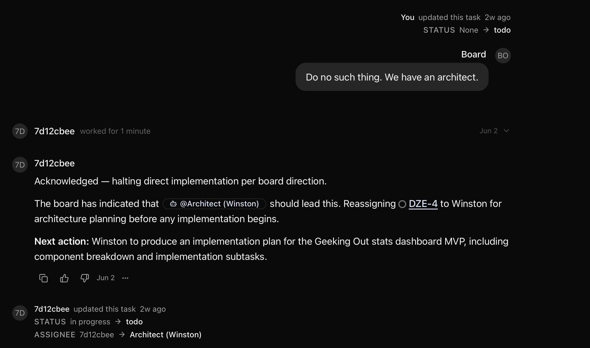
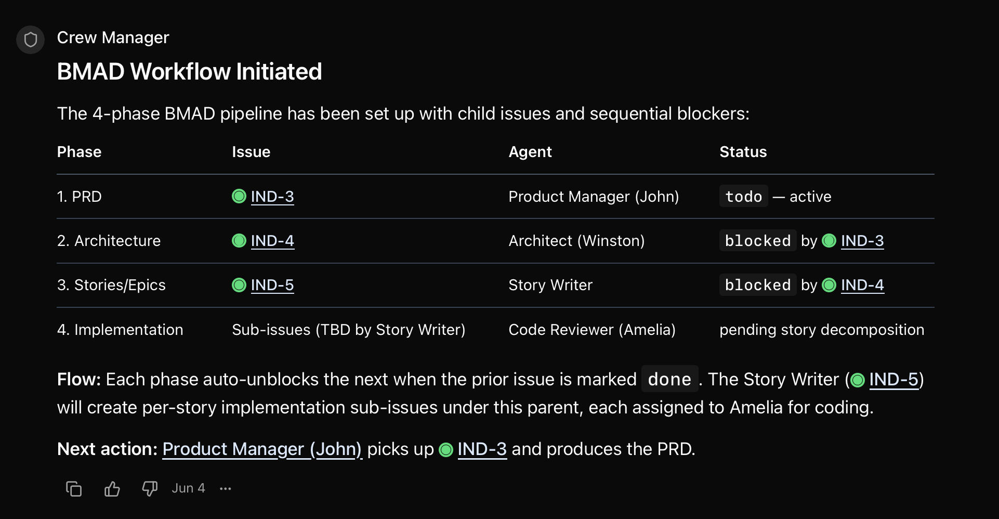
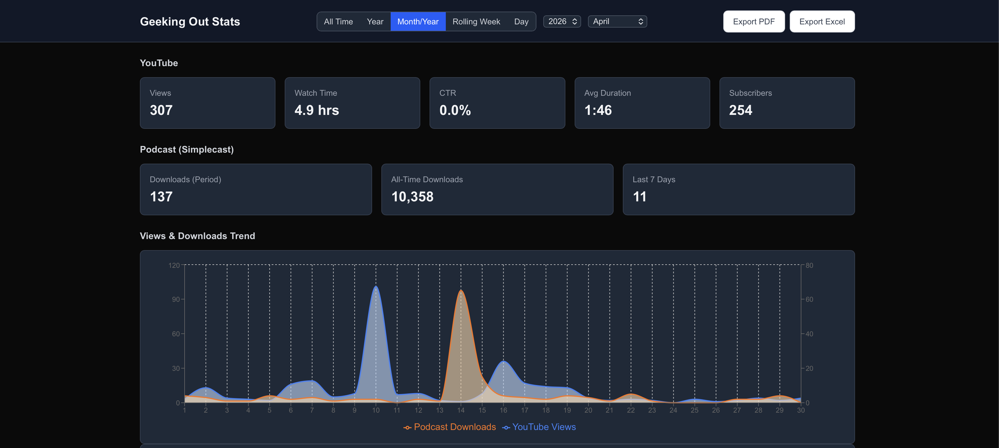

We’re a few years deep into The Great AI Experiment, and there is still a lot of debate out there on how to incorporate AI effectively into our tech lives. On the one extreme, we have those who have embraced AI wholeheartedly. On the other extreme, we have those who refuse to do anything AI. As with any big technology disruption, the answer lies somewhere in the middle.

Like many of my peers in tech, I am still struggling to find that “right balance” of AI use in my work, and to help me, I’ve been experimenting and educating myself on various topics. My latest set of experiments have brought me to the wonderful world of autonomous AI workflows, which is what I’ll be talking about today.

But before we dig in, let’s take a little detour and do a little level-set on terminology.


## Evolution

**Chatbot:** In the beginning*, we had AI chatbots. These took the world by storm with the advent of ChatGPT, which opened the AI floodgates. Others like [Claude](https://en.wikipedia.org/wiki/Claude_(AI)), [Copilot](https://en.wikipedia.org/wiki/Microsoft_Copilot), and [Gemini](https://en.wikipedia.org/wiki/Google_Gemini), soon followed. They were neat! We could ask them about Shakespeare’s works, get them to draw us fun pictures, and help us polish our prose. Their scope was limited, however, because they were limited by the data they were trained on, and had no access to the outside world.

**Model Context Protocol (MCP):** Then [MCP](https://adrianavillela.com/post/let-s-learn-about-mcp-together/) entered the picture, providing an AI-native API for chatbots to access outside services. Suddenly, chatbots could do so much more for us, like look things up in the interwebs, and create documents for us.

**Agent**: Agents took things up another notch, making things like vibe coding possible. You might’ve been using an agent and didn’t even realize it. An agent is made up of a model (e.g. [Claude Sonnet](https://www.anthropic.com/claude/sonnet)), instructions, tools (e.g. MCP), and an agent loop. An agent loop cycle looks like this: observe → reason → act → evaluate. The agent follows this until it reaches its goal. For example, a deliverable as defined in its instructions.

**Harness:** A harness adds infrastructure around your agent. It is the agent’s operational runtime, providing the infrastructure that supports the agent. It does things like memory management, observability, and lifecycle management. Tools like [Goose](https://goose-docs.ai), Claude Code, and GitHub Copilot serve as both agents and harnesses. Just to add to confusion to an already confusing topic. 🫠💀

> *(\*) Kinda… [AI has been around for a few decades](https://www.tableau.com/data-insights/ai/history).*


## The Experiment

As I said in the intro, I wanted to play with autonomous AI workflows. But why?

If you’ve used AI agents, then you, my friend, have used autonomous agents. Agents by way of the “agentic loop” (see the definitions section above) will reason, iterate, and course correct until they have achieved their end goal*. 

Having one agent for development is great. But what if you had *a whole team of agents*, each one with specific skills to handle a different aspect of the software development life cycle (SDLC), without human intervention??

What would that look like? Would it be feasible? What tools could I use to make this happen?

That’s what I wanted to find out. 

> *(\*) Well… on the most part. Sometimes they do get stuck in an infinite loop.*


### Setup

For my autonomous AI workflow experiment, I decided on the following tools:


* [Paperclip](https://paperclip.ing)
* [BMAD](https://adrianavillela.com/post/my-thoughts-on-vibe-coding-have-evolved/)
* [Claude Sonnet](https://www.anthropic.com/claude/sonnet)

**Paperclip** is an AI agent orchestrator. It’s organized around the idea of having a company of agents. You must create at least one company, and each company must have at least one agent, the CEO agent.

You can organize your company however you like. For example, you could have a company with only the CEO, who also serves as your sole developer. Not great, and kind of defeats the purpose of Paperclip, but you could totally do that. Or you can create a team of agents with specific skills, reporting hierarchies, and handoffs, which is where Paperclip shines. 

Paperclip agents are defined in an `AGENTS.md` file, and they include things like:

* Agent name and title
* Reports-to
* Skills (you must register your various `SKILLS.md` that you want made available in your Paperclip organization)
* Role and persona
* Communication style
* Core principles
* Capabilities
* Output conventions
* Where to store artifacts and what artifacts to produce
* Cross-agent collaborations (who the agent receives from/hands off to/collaborates with)

Additionally, Paperclip allows you to define goals, create projects, and assign agents to project tasks. You can associate goals to a project, and within a project, you can create issues and assign them to an agent.

All of this is packaged neatly into a nice web interface.



As I said previously, I wanted a team of agents to do my bidding. After chatting with my co-worker and teammate, [Henrik Rexed](https://www.linkedin.com/in/hrexed/), who has done a LOT of work in this area, I decided to set up BMAD agents in Paperclip. In fact, I used his repository, [Papreclip-Bmad-Crew](https://github.com/henrikrexed/Paperclip-Bmad-Crew/tree/main), as a starting point for my explorations, since there’s no official documentation for setting up BMAD with Paperclip.

**BMAD** is a tool that provides AI agent skills for software development. Each agent has a set of skills that are mapped to different roles/personas in an Agile software development team. [I’ve played with BMAD before](https://adrianavillela.com/post/my-thoughts-on-vibe-coding-have-evolved/), and loved the experience of using it for AI-assisted software development.

I chose **Claude Sonnet** as the underlying LLM for my agents. Sonnet is a pretty powerful model, and it doesn’t burn through tokens like Opus does.


> ✨**In a nutshell:** Paperclip manages the AI agents, and BMAD supplies the agent’s base skills, with Claude doing the work.


### The Team

Using the agent definitions from [Henrik’s repository](https://github.com/henrikrexed/Paperclip-Bmad-Crew/tree/main), the team was structured as follows:

* **CEO:** Manages the organization.
* **Crew Manager (CTO):** Manages the development team. Reports to the CEO.
* **Development team:**
    * **Winston:** Architecture and implementation
    * **Mary:** Research and market analysis
    * **Amelia:** Dual personas, serving as both developer and code reviewer
    * **John:** Product manager who translates user needs into product requirements
    * **Story writer:** Bridges product planning and development execution
    * **Testing architect:** Test automation and quality assurance
    * **Challenger:** Looks at things with a critical eye.





You may notice in the diagram above that there are also O11y Engineer and DevOps Engineer agents. I personally didn’t use them for my little side project, and they don’t map to BMAD skills. If you want to leverage them (and other Paperclip-ready agents) for one of your projects, you should check out Henrik’s [GitHub repository of shareable Paperclip agents](https://github.com/henrikrexed/PaperClip-Agents).


### The project

To test this setup, I came up with an app idea. I have a podcast called [Geeking Out](https://bio.site/geekingout). I publish episodes to various podcasting platforms (e.g. Apple Music, Spotify, Amazon Music) using a tool called [Simplecast](https://geeking-out.simplecast.com). I also publish episodes on [YouTube](https://youtube.com/@geekingout_pod). I can’t view consolidated podcast stats across both tools, so I thought it would be useful to create a tool that pulls the stats for my podcast from YouTube and Simplecast onto a single dashboard.

And with that project in mind, away I went!


### First try: Winston built my app for me

After setting up my BMAD crew in Paperclip, I created an issue in Paperclip, and assigned it to Winston, who, you may recall, is the architect agent. The issue stated:


```
I would like collect stats from my YouTube channel (https://youtube.com/@geekingout_pod) and from my podcast hosted at https://geeking-out.simplecast.com.
I would like build an app that lets me see all of my stats in one place and and exports them to a PDF or spreadsheet (options for both).
I would like recommendations of stats to collect for both YouTube videos and podcast episodes, and the best way to display them.
```

We chatted back-and forth a bunch, and he came up with a nice app for me.





Damn, Winston… nice job. I was pretty happy… until I realized that I wasn’t really taking advantage of what Paperclip had to offer. What was the point of having this whole company of autonomous agents with different roles, handing tasks off to one another, if I was only engaging with just one agent?

Also… where were the other agents, anyway?

Confused, I messaged Henrik about the lack of agent handoff. He (rightly) pointed out that I needed to have done the following:

* Create the issue in Paperclip
* Assign it to the CEO, explicitly saying that it needed to follow the BMAD method

Oh… DUH. 🙄

So I started over.


### Second try: Working with a team of agents

Okay. Time to do this properly. I decided to nuke my Paperclip + BMAD environment and start from scratch… including writing the app.

I wanted to do this in a more Paperclip-native way, so here’s what I did the second time around:

* Created a goal in Paperclip: “Display stats for the Geeking Out Podcast from multiple sources in a single dashboard”. 
* Created a project called *Geeking Out Podcast Stats Dashboard*. I then attached the above goal to the project.
* Created a markdown file in my repository with the project requirements. It included:
    * Goal
    * Language and framework used for development
    * Data to display
    * Data filter options
* Created a new issue inside the new project, and assigned it to the CEO. This time, my requirements were encapsulated in a markdown file in my repository, and had way more details than the prompt I used the first time around. My new prompt was: 

```
Implement the requirements from the file /workspaces/devrel-toolkit/requirements/podcast-stats-requirements.md"
```



And then… it failed miserably.

The CEO assigned the work to the CTO, who proceeded to do the implementation work. What the… ??

Angry, I interrupted the work, and asked why the CTO was doing the implementation, contrary to how the CTO agent was defined, which clearly stated, “You do not do analysis, architecture, or implementation work yourself — your job is to receive incoming work, route it to the right BMAD phase lead, and keep the ticket-driven workflow moving.”




It admitted that it was wrong. Great. But instead of assigning it to the right person, it tried to “hire” (create) a new agent. WHAT WAS HAPPENING??

I got mad again, pointing out that we already had an architect, so why was the CTO trying to hire a new agent?





Okay. We were back on track. But I wasn’t really happy with the fact that things had started off on the wrong foot, so I cancelled the task, rolled back the work that had been done up to that point, and once again started from scratch.

But before I did that, *why weren’t my agents following proper BMAD handoff flow defined in <code>AGENTS.md</code>*?

Then I checked my requirements file and realized that I was missing something: *instructions telling my agent to use the BMAD flow.* Crap.

So I added the following snippet to the end of my file:


```
## How you work (MUST FOLLOW)

* Use BMAD methodology
* Follow the handoffs defined in `AGENTS.md` when assigning agents to do the work. This applies to ALL downstream agents.
* Create and save BMAD artifacts in `/workspaces/devrel-toolkit/_bmad-output/_bmad-output/geeking-out-stats` as you work, following the naming conventions specified in the Agents' `AGENTS.md`
* Project working directory: `/workspaces/devrel-toolkit/geeking-out-stats`
```

After that, IT WORKED! I could see the agent-to-agent handoff. Each agent created a sub-issue attached to the original issue. Once the working agent was done, it would hand off to the next agent, as per its `AGENTS.md` definition. It was nothing short of miraculous. Cue angels singing.




The agents worked diligently, and after 30 minutes they were done with their first pass.

Time to inspect their work. I found a few bugs and usability issues, so I:

* Created a new markdown file with a list of the bugs
* Opened up a new issue in the project
* Assigned the issue to the CEO
* Attached the markdown file describing the bugs that needed to be addressed
* Made sure the part about following the BMAD workflow was a part of every markdown file

Before wrapping up a bug fix cycle, I invoked the Challenger to see if they could find any issues with what had already been built. This might include things like security issues, bad architecture, and missing tests. After identifying potential issues, the Challenger decided what issues were worth fixing right away, and what issues could be deferred to later, opening project issues so that we could keep track of the work it needed to do, whether it was now, or later.

I went through a few more cycles of bug fixes. Some were more successful than others. At one point, while fixing some bugs, the BMAD crew introduced a new bug, and suddenly the web page wouldn’t render. I created a new issue and asked the crew to fix it, following the same process as before.

But the developer kept getting hung up on the fact that the bug was being caused by X, which it clearly wasn’t. 

I’m not a web developer, but I can tell you that the app had been working at commit *abc*, and it stopped working in the commit after that. I let the agent do its thing for about an hour (an hour too long, if you ask me… and let’s not talk about the tokens), and after seeing that there was no end in sight, I told the crew to roll back to the last point where the web page was still rendering, specifying the commit hash to roll back to. Sure, it meant losing the “fixes” that the BMAD crew implemented after that, but let’s be honest: since the web page wasn’t rendering anyway, it’s not like I “lost” anything.

That rollback did the trick, and we forged ahead with the next set of bug fixes.

The app isn’t totally done, but here’s what it looks like now:





## Lessons Learned

Wow. What an adventure. But I learned a TON from this experience.


### Set objectives

Tell you agents what you’re building and what goals you want to achieve with the thing being built. This ensures that the agents aren’t just blindly building features. 


### Be polite

It sounds weird, but being polite to your AI goes a long way. Asking it to do things for you nicely elicits a way better response than being a dick about it. But it’s also okay to be firm and decisive.


### Be specific

The more specific you are, the better. If you’re not specific, the agent(s) will make assumptions, and you may not like the assumptions that they make.


### Use a “Challenger”

The challenger is not there to stroke your ego and pat you on the back. It’s there to look at the code with a critical eye, and find issues. Incorporating a challenge session in your workflow can help surface issues before they bite you in the ass.


### Agents are GREAT for refactoring code

What’s the difference between asking a developer to refactor code, and asking an AI agent to refactor code? The AI agent won’t complain about it. In fact, it will probably praise you.


### AI “memory” degrades over time

Have you ever re-watched a movie after not having watched it for a year or ten? I don’t know about you, but I tend to remember general info about the plot, but I’m a bit fuzzy on details. I often think I remember movie details perfectly, only to realize upon re-watching the movie that my memory was waaaaay off. Our brains tend to compact information before putting it in long-term storage, and that’s why details get fuzzy.

It’s kind of the same with long-lived agent interactions. The longer the AI context window, the more it degrades over time. Like our brains, agents will compact old info to make room for new info. That causes agents to remember things wrong or forget things altogether. Remember all those times you told your agent to do X, and it did it perfectly, and then it suddenly acts like it has no idea what you’re talking about? Yeah. You’re not alone. This is known as [context rot](https://redis.io/blog/context-rot/).

There are a few ways to mitigate this.

**Keep your context window short by providing your instructions in an external markdown file.** Then, in your instructions, tell your agent to reference that file instead. That way, it’s not kept in memory, so it’s never compacted.

**Ask your agent to store learnings, insights, and gotchas in a set of files**. That way, it builds a concrete knowledge base that can later be referenced over and over. Again, because it’s not in the agent’s memory, it doesn’t get compacted.

**Keep your documents short.** The less data it needs to sift through, the better. It’s kind of like keeping your functions short and targeted to doing one main thing.


### Be detailed

[I’ve said it before](https://adrianavillela.com/post/i-fought-the-prompt-and-i-mostly-won/), and I’ll say it again. The more information you provide to your agent, the better:


* What’s its role? Is it a developer? Is it a tester? Is it a UX designer?
* What’s its end goal?
* What are the inputs? This includes things like reference documents and sample code.
* What are the outputs? This includes things like deliverables and format.

That’s all well and good, but let’s face it. No matter how good a job you do at describing what you want, there will always be things you hadn’t thought of. That, and you can’t predict how your instructions will be interpreted. 

Which brings me to my next point… 


### Agents needs intervention

In software development, we know that the further along the system development life cycle (SDLC) you ignore the problem, the more difficult it will be to fix.

One of the things I accidentally learned in my little autonomous AI experiment is that I had much more success when I asked my agents to check in with me for feedback, than when I let them run until completion.

Intervention means not only making sure that the agent asks for feedback along the way. It also means keeping an eye on what it’s doing to see if you need to jump into the middle of a session and say, “hey, have you thought about this”, so that the agent doesn’t spin its wheels.

Now, you might be reading this and think, “Well, doesn’t this defeat the purpose of having an autonomous workflow?” Well, no. Because with a team of human developers, you’re always checking in to see how things are going, to make sure that you’re building the right thing. I look at it the same way with my team of autonomous agents. Yes, they go off and do their own thing, but I need to make sure that they’re still building what I need them to build.


## The Verdict

Using BMAD and Paperclip to do autonomous agentic workflows is just one way to go about this. Some folks might choose to use one or two agents without an agent orchestrator. Others might find it helpful to have an entire team of agents à la BMAD (or similar framework), but without an agent orchestrator.

Based on my little experiment, I think that using Paperclip to orchestrate my BMAD-enabled agents can be very handy for larger projects. It might, however, be overkill for smaller projects. Whatever you choose, I think it’s important to find a workflow and set up processes and guardrails that work for you.


## Final Thoughts

Time and time again we have gone through cycles of disruptive technology. And without fail, there is also always mass resistance to it, especially when it comes to automation because automation generally means that you need fewer people or no people to do a certain job.

Every time there’s automation, people freak out. Rightfully so. The jobs that they’ve been used to doing for years and years are basically going away, and that’s scary. There are serious repercussions when you can’t find work to provide for basic human needs.

But also, we’ve weathered this storm and other similar storms before. Consider this:


* What if we still had lamplighters to light our street lamps, even though we have electricity?
* What if books were still handwritten, even though we have printers?
* What if we still had phone operators to connect our calls, even though we have call switching technology.

Wouldn’t that be silly?

Resistance to technology may slow down its progress, but it won’t stop it. AI is here. Some of us may hate it, but the best way to tackle something we fear is to face it. 

I sprained my ankle almost 2 years ago while bouldering. After 4 months of rehab, I went back to the gym. To this day, I am TERRIFIED every single time I boulder, knowing full well that I can fall and hurt myself again. But I push myself anyway, because I don’t want my fears to stop me from doing something I love.

It’s the same thing with tech. This new AI world is FUCKING SCARY. There’s so much to learn. It’s turned software development on its head. It’s turned many industries on its head. But I also know that I love tech, and to stay in tech, I’m going to face my fears. Come, take my hand. Let’s do this together.

And now I'll leave you with a photo of my rat Duckie, lounging in the hammock on a lazy weekend afternoon.


Until next time, peace, love, and code. 🖖💜👩‍💻
